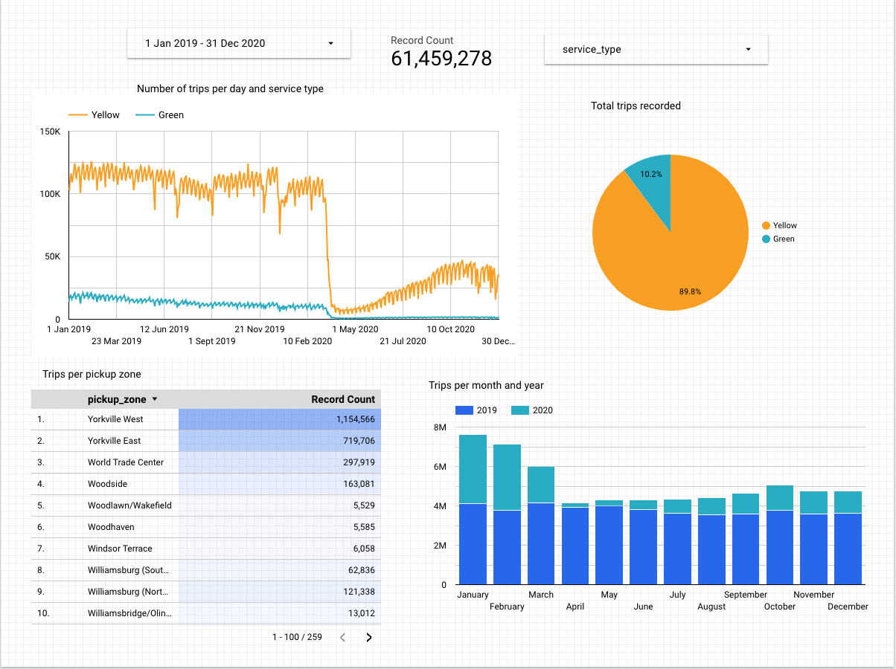
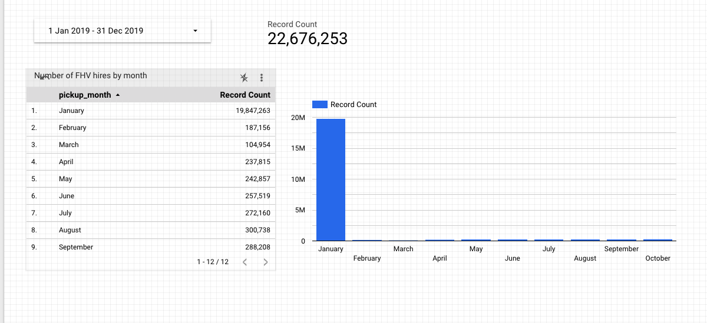

# Homework

## Google Studio Dashboards

### Yellow and Green Taxi data analysis

### FHV data analysis

### Question 2
What is the distribution between service type filtering by years 2019 and 2020 data as done in the videos . (Yellow/Green)

`89.9/10.1`

### Question 3
Question 3: What is the count of records in the model stg_fhv_tripdata after running all models with the test run variable disabled 

`
SELECT COUNT(*) FROM atomic-voice-338721.production.stg_fhv_tripdata;
`

### Question 4

What is the count of records in the model fact_fhv_trips after running all dependencies with the test run variable disabled 

From dashboard

`22676253`

### Question 5
What is the month with the biggest amount of rides after building a tile for the fact_fhv_trips table

From dashboard
`January`

